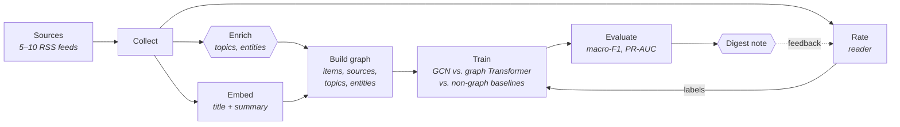

# Midterm: pipeline

```mermaid
flowchart LR
    A["Sources<br/><i>5–10 RSS feeds</i>"] --> B["Collect"]
    B --> C{{"Enrich<br/><i>topics, entities</i>"}}
    B --> D["Embed<br/><i>title + summary</i>"]
    B --> R["Rate<br/><i>reader</i>"]
    C --> G["Build graph<br/><i>items, sources,<br/>topics, entities</i>"]
    D --> G
    G --> M["Train<br/><i>GCN vs. graph Transformer<br/>vs. non-graph baselines</i>"]
    R -->|labels| M
    M --> E["Evaluate<br/><i>macro-F1, PR-AUC</i>"]
    E --> N{{"Digest note"}}
    N -.->|feedback| R
```

`{{hexagons}}` = LLM calls; rectangles = code or the reader.
